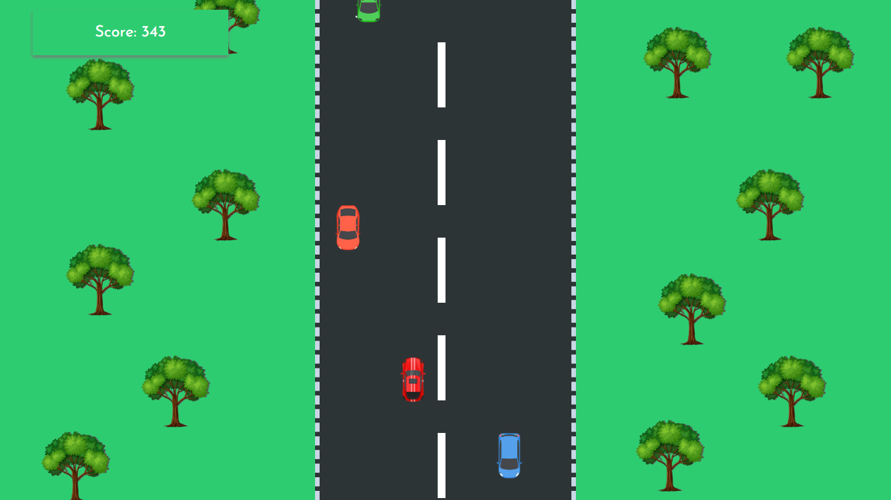

# Car Game

### Car Game is a simple web-based game created using HTML, CSS, and JavaScript. The goal of the game is to control a car and avoid obstacles on the road. The game is designed to be fun and addictive, and it's suitable for players of all ages.

## How To Play
#### To play the game, simply use the arrow keys on your keyboard to control the car. You need to avoid other cars on the road. If you hit an car, the game will be over, and you'll need to restart.

## Technologies used
#### The game was created using the following technologies:

## Click here to play: [Play Now](https://sahilatahar.github.io/Car-Game/)

## :camera: Image Preview

## Other Projects
### Here are some other projects that you might be interested in:
### (1) [New Portfolio](https://github.com/SahilAtahar/newportfolio)
### (2) [18+ HTML,CSS,JavaScript Projects](https://github.com/SahilAtahar/HTML-CSS-JavaScript)
### (3) [Random Joke Generator](https://github.com/SahilAtahar/Random-Joke-Generator)
### [more](https://github.com/SahilAtahar)
